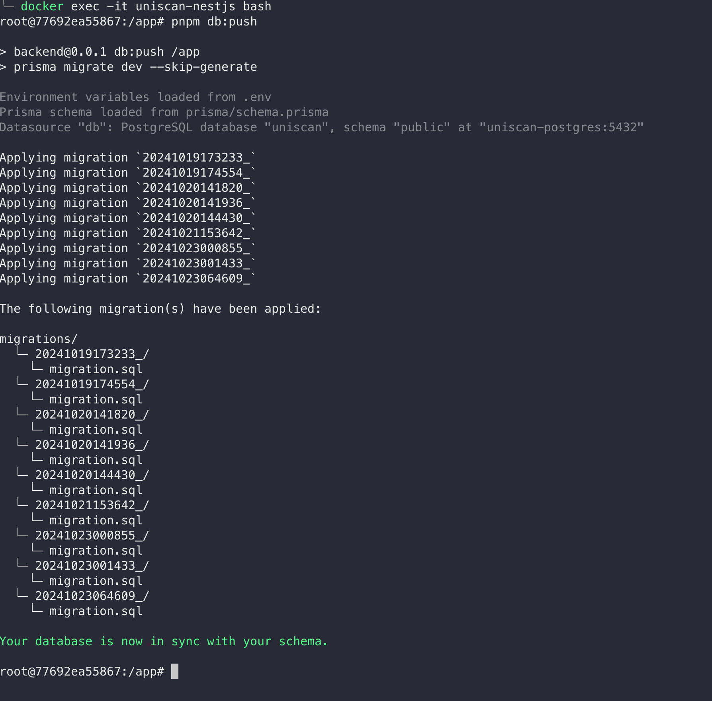
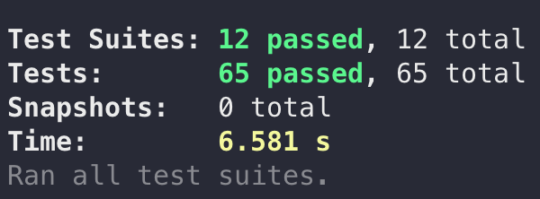
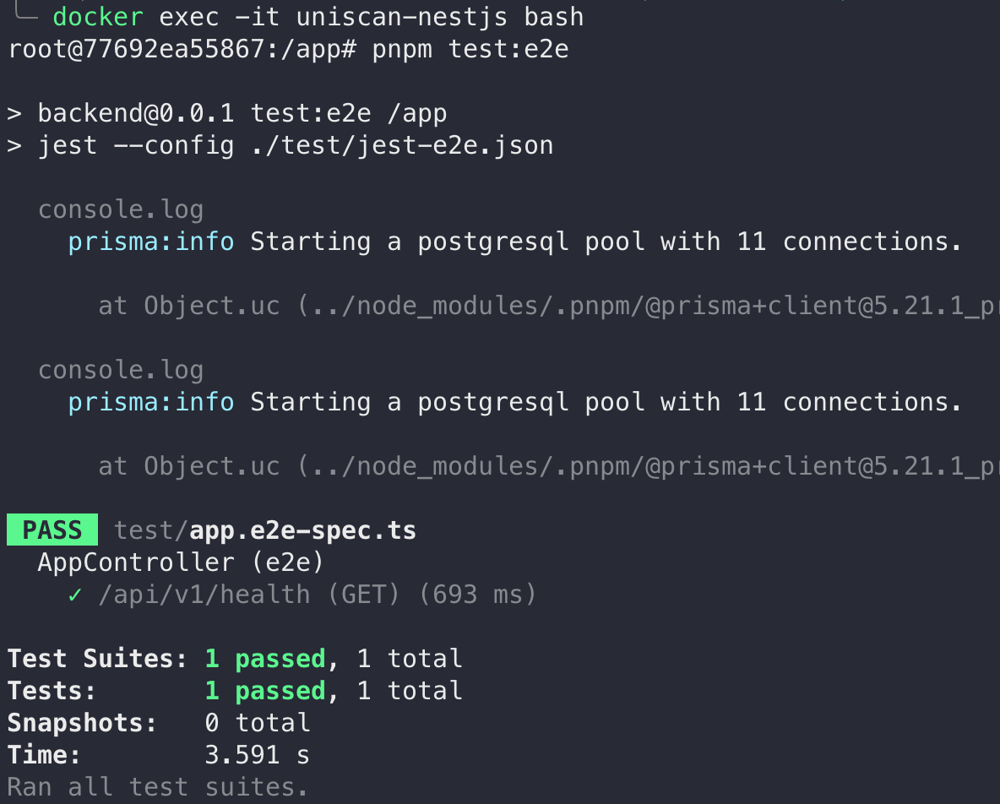

# uniscan


## Demo Video

View the demo video [here](https://youtu.be/Llf3kSnb6PY).

## Installation

### Clone the repository

```bash
git clone https://github.com/hwennnn/uniscan.git
cd uniscan
```

### Copy the environment variables

```bash
cp .env.example .env
```

and update the `.env` file with the correct values.

### Run in Docker Compose

#### Development mode

```bash
docker compose -f docker-compose.yml -f docker-compose.dev.yml stop && \ 
  docker compose -f docker-compose.yml -f docker-compose.dev.yml --env-file .env up --build
```

#### Production mode

```bash
docker compose -f docker-compose.yml -f docker-compose.prod.yml stop && \ 
  docker compose -f docker-compose.yml -f docker-compose.prod.yml --env-file .env up --build
```

### Setup Prisma Schema (in development)

After spinning up the containers, run the following command to initialise the database schema:

```bash
# SSH into the container
docker exec -it uniscan-backend bash

# Inside the container shell
pnpm db:push # to push the schema to the database
# or
pnpm db:sync
```


After pushing the DB schema, you are ready to go 🎉🎉.

View the frontend at `http://localhost:80` and the backend at `http://localhost:80/api/v1`.

You can check whether the backend is running by visiting `http://localhost:80/api/v1/health`.

## API Documentation

Please refer to the [API documentation](docs/API_DOCUMENTATION.md) for more information.

## Architecture Considerations

### Backend Architecture

For the backend, the following technologies were chosen:

- **NestJS**
- **Prisma**
- **PostgreSQL**
- **Redis**
- **BullMQ**
- **ethers**
- **Typescript**
  
For the backend, I am using **NestJS**, **Prisma**, **PostgreSQL**, **Redis**, and **BullMQ** to effectively handle high transaction throughput which is required in this project. I am also more familiar with **NestJS**, **Prisma**, and **PostgreSQL** so that helps a lot to complete this in a short amount of time. I choose **PostgreSQL** as it's a powerful relational database that offers robust data integrity and supports complex queries. **Redis** plays a crucial role in caching frequently accessed queries such as the latest ethereum price and integrates seamlessly with **BullMQ** to distribute workload across the queue. By utilizing a message queue, I have decoupled the processing of historical transaction batches from the main server operations. Jobs are executed through the queue, and the client continuously polls to check the status of these jobs, ensuring a more efficient workflow.

### Frontend Architecture

For the frontend, the chosen technologies include:

- **Vite**
- **Tailwind CSS**
- **Typescript**
- **React Query**

For the frontend, I am using **Vite** alongside **React Query**. **React Query** provides query optimization and offers numerous built-in features for managing complex queries and pagination.

## Run Testing

### Backend



```bash
pnpm test
```



```bash
docker exec -it uniscan-nestjs bash

# Inside the container shell
pnpm test:e2e
```

### Run CI locally with `act`

```bash
# Run all tests
act

# Run backend tests
act -j backend-tests

# Run frontend lint
act -j frontend-lint
```
